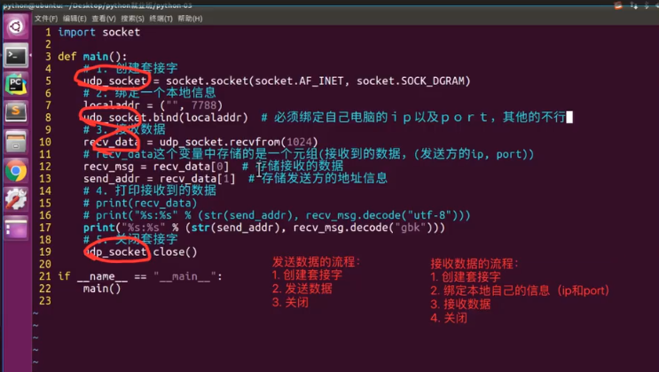
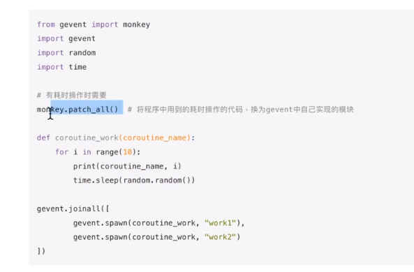

**创建一个tcp socket**

    import socket 
    #创建tcp socket  
    s = socket.socket(socket.AF_INET, socket.SOCK_STREAM)

    #功能
    
    #关闭套接字
    s.close
    
    
**创建一个udp socket**

    import socket
    #创建tcp socket
    s = socket.socket(socket.AF_INET, socket.SOCK_DGRAM)
    
    #功能
    
    #关闭套接字
    s.close

**协程**

